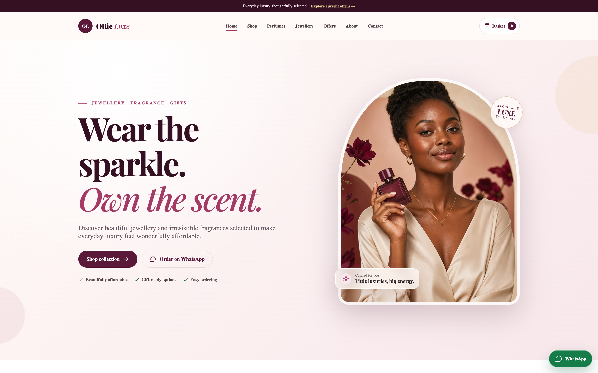

# Ottie Luxe

### A full-stack jewellery, fragrance, and gift storefront built for a Zimbabwean small business

[View the live website](https://ottie-luxe.vercel.app/) · [Explore the shop](https://ottie-luxe.vercel.app/shop)

[](https://ottie-luxe.vercel.app/)

## About the project

Ottie Luxe is a responsive e-commerce catalogue that makes online selling simple for a small retail business. Customers can discover products, search and filter the catalogue, save favourites, select product variants, and build a basket before sending one structured order enquiry through WhatsApp.

The application also includes a protected owner studio for managing products, categories, promotions, stock, variants, and product images without editing code. It is designed around the way the business operates: WhatsApp remains the final sales channel while the website provides a polished, reliable product-discovery experience.

## Key features

### Customer experience

- Responsive, mobile-first storefront for jewellery, perfumes, and gift sets
- Search, category filtering, availability filtering, and price/newest sorting
- Dynamic product pages with options, variants, prices, and stock states
- Persistent basket and favourites using browser storage
- Server-side availability checks before an order enquiry is created
- Structured WhatsApp order messages with quantities, totals, fulfilment preference, and notes
- Accessible navigation and cart dialogs with keyboard focus management
- Graceful seed-catalogue fallback when Supabase is not configured

### Owner experience

- Supabase email/password authentication and password recovery
- Role-protected administration area
- Product creation and editing with Zod-validated Server Actions
- Variant generation for configurable product options
- Stock, publication status, pricing, badges, and display-order management
- Product image upload and removal through Supabase Storage
- Category and time-based promotion management
- Draft product previews and cache revalidation after updates

### Production quality

- Dynamic metadata, canonical URLs, Open Graph cards, JSON-LD, sitemap, robots rules, and web manifest
- Responsive image delivery with Next.js Image
- Security headers and database Row Level Security policies
- Optional privacy-friendly Umami analytics with custom commerce events
- Unit, end-to-end, cross-browser, accessibility, and database policy tests
- Automated quality and release checks with GitHub Actions
- Production deployment on Vercel

## Skills demonstrated

| Area | What I implemented |
| --- | --- |
| Full-stack development | Built the application with Next.js App Router, React Server Components, Client Components, Server Actions, and dynamic routes. |
| UI/UX design | Created a cohesive luxury brand system, responsive layouts, reusable components, clear product discovery, and a low-friction WhatsApp ordering flow. |
| Type-safe engineering | Modelled catalogue, variant, stock, basket, and promotion data with strict TypeScript and validated form input with Zod. |
| Database design | Designed a relational PostgreSQL catalogue covering categories, products, options, variants, images, promotions, and administrator profiles. |
| Authentication and security | Implemented Supabase Auth, SSR cookie handling, owner authorization, Row Level Security, storage policies, constrained SQL functions, and HTTP security headers. |
| State management | Built reusable React context and external-store synchronization for persistent baskets and favourites, including malformed-data recovery. |
| Testing | Covered business logic with Node's test runner, complete customer flows with Playwright, accessibility with axe-core, and RLS guarantees with pgTAP. |
| SEO and analytics | Added structured data, social metadata, dynamic sitemap entries, crawl controls, canonical URLs, and optional Umami event tracking. |
| DevOps | Created a GitHub Actions pipeline for linting, type checking, unit tests, production builds, and multi-browser end-to-end tests; deployed on Vercel. |

## Tech stack and tools

| Layer | Technologies |
| --- | --- |
| Frontend | Next.js 16, React 19, TypeScript, CSS, Lucide React |
| Backend | Next.js Server Components and Server Actions |
| Data and authentication | Supabase, PostgreSQL, Supabase Auth, Supabase Storage, `@supabase/ssr` |
| Validation | Zod |
| Testing | Node.js test runner, Playwright, axe-core, pgTAP |
| Code quality | ESLint, strict TypeScript, GitHub Actions |
| Analytics | Umami (optional) |
| Deployment | Vercel |
| Design and development tools | Git, GitHub, VS Code, responsive browser testing |

## Architecture highlights

- Public catalogue reads are performed in Server Components, while product-detail lookups use React request memoization.
- The storefront displays bundled seed data when Supabase credentials are absent, so local development remains usable.
- Customer basket data stays in the browser; personal details are composed directly into the WhatsApp enquiry instead of being stored by the application.
- Before opening WhatsApp, a Server Action checks the latest catalogue state to prevent stale or unavailable items from being submitted.
- Public users can read only active categories, published products, and currently active promotions. Owner write access is enforced in PostgreSQL with Row Level Security, not only in the interface.
- Product option and variant replacement is handled atomically in the database.

## Getting started

### Prerequisites

- Node.js 24
- npm
- A Supabase project for the live catalogue and owner studio (optional for the seed-data demo)

### Installation

```bash
git clone https://github.com/Janvierscode/ottie_luxe.git
cd ottie_luxe
npm install
cp .env.example .env.local
npm run dev
```

Open [http://localhost:3000](http://localhost:3000) in your browser.

The storefront works with local seed data if Supabase is not configured. To enable the database-backed catalogue and owner studio, add your Supabase values and apply the SQL files in `supabase/migrations` in filename order. You can then load `supabase/seed.sql`, create an Auth user, and add that user's ID to `public.admin_profiles`.

## Environment variables

| Variable | Required | Purpose |
| --- | --- | --- |
| `NEXT_PUBLIC_SITE_URL` | Recommended | Canonical application URL used by metadata and authentication redirects |
| `NEXT_PUBLIC_SUPABASE_URL` | For live data | Supabase project URL |
| `NEXT_PUBLIC_SUPABASE_PUBLISHABLE_KEY` | For live data | Browser-safe Supabase publishable key; data access remains protected by RLS |
| `NEXT_PUBLIC_UMAMI_SCRIPT_URL` | Optional | Umami analytics script URL |
| `NEXT_PUBLIC_UMAMI_WEBSITE_ID` | Optional | Umami website identifier |

## Available scripts

```bash
npm run dev        # Start the local development server
npm run build      # Create a production build
npm run start      # Run the production server
npm run lint       # Run ESLint
npm run typecheck  # Check TypeScript without emitting files
npm test           # Run catalogue and basket unit tests
npm run test:e2e   # Build the app and run Playwright end-to-end tests
```

The Playwright suite runs against Chromium, Firefox, WebKit, Pixel 7, and iPhone 14 profiles. It checks the primary shopping journey, product variants, mobile navigation, responsive overflow, and serious or critical WCAG 2A/2AA accessibility violations.

Database authorization policies are tested separately with pgTAP in `supabase/tests/rls.test.sql`.

## Project structure

```text
app/                 Next.js routes, metadata, auth callbacks, and Server Actions
components/          Storefront, basket, product, and admin UI components
lib/                 Catalogue logic, data access, auth, analytics, and configuration
public/              Static brand imagery and the project screenshot
supabase/migrations/ PostgreSQL schema, functions, indexes, RLS, and storage policies
supabase/tests/      Database authorization tests
tests/unit/          Catalogue and basket business-logic tests
tests/e2e/           Cross-browser storefront and accessibility tests
.github/workflows/   Automated quality and release checks
```

## Deployment

The production application is deployed on Vercel:

**[ottie-luxe.vercel.app](https://ottie-luxe.vercel.app/)**

---

Designed and developed as a complete digital storefront for Ottie Luxe, combining brand-focused UI design with secure full-stack engineering.
